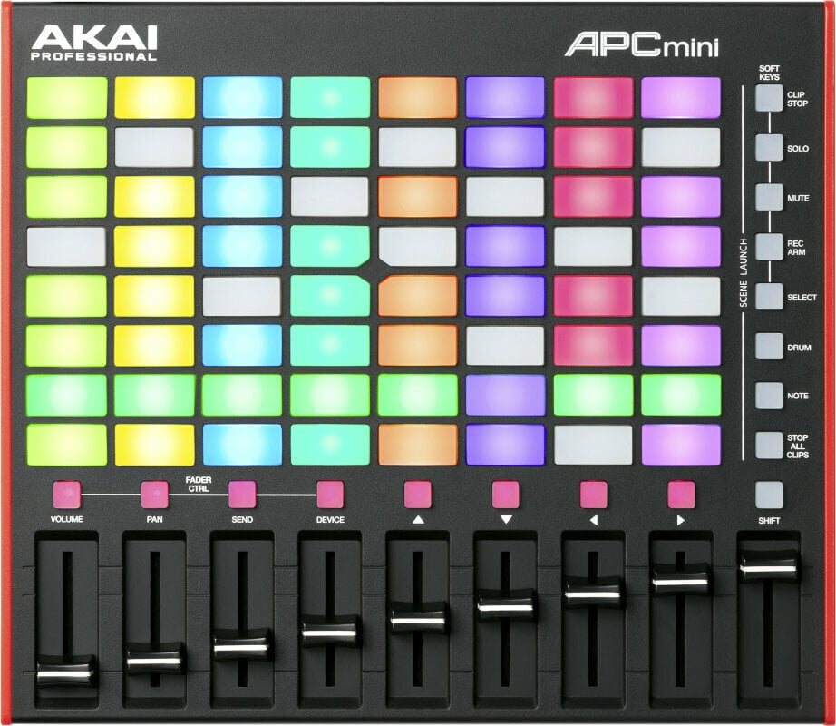

# Hardware reference — AKAI APC mini mk2

The AKAI APC mini mk2 is the controller this project drives. This page captures the physical layout for future reference; the byte-level MIDI protocol lives in [`midi_and_apc_mini_mk2/`](midi_and_apc_mini_mk2/README.md).

## At a glance

A compact (~24 × 20 cm) USB-MIDI controller laid out as:

- An **8 × 8 grid of RGB pads** (top-left, the bulk of the surface). Each pad is independently lit, supports a 128-color palette, and can be set to solid / pulse / blink behaviors.
- A horizontal row of **8 single-colour buttons** (red) just below the grid, labelled **VOLUME · PAN · SEND · DEVICE · ▲ · ▼ · ◀ · ▶** — collectively the "FADER CTRL" / soft-keys row.
- A **9th button labelled SHIFT** at the right end of that row.
- A vertical column of **8 single-colour buttons** (white) on the right side, labelled top-to-bottom: **CLIP STOP · SOLO · MUTE · REC ARM · SELECT · DRUM · NOTE · STOP ALL CLIPS** — collectively the "SCENE LAUNCH" column.
- A row of **9 faders** along the bottom: 8 channel faders + a 9th master fader on the far right.

The body is a flat black plastic with red trim. The unit is bus-powered over USB; no external power required.

## MIDI map

Verified against the AKAI APC mini mk2 protocol PDF v1.0; cross-referenced in this repo at [`midi_and_apc_mini_mk2/03_note_assignments.md`](midi_and_apc_mini_mk2/03_note_assignments.md).

| Element | Count | MIDI assignment | Notes |
|---|---|---|---|
| RGB grid pads | 8 × 8 = 64 | Note 0..63 | Row-major order. Velocity 1..127 selects a palette colour; **MIDI channel** selects the LED behaviour (solid, pulse 1/8, pulse 1/16, true blink — see [`05_led_protocol.md`](midi_and_apc_mini_mk2/05_led_protocol.md)). |
| Top "FADER CTRL" row buttons (VOLUME, PAN, SEND, DEVICE, ▲, ▼, ◀, ▶) | 8 | Note 100..107 | Single-colour (red). Velocity 0/127 = off/on; velocity 2 = blink. |
| SHIFT (top-right) | 1 | Note 122 | Single-colour. The original Node.js bridge treated this as a blackout (BO) toggle — on the mk2 it's labelled SHIFT and is best left available as a configurable modifier. |
| SCENE LAUNCH column (CLIP STOP, SOLO, MUTE, REC ARM, SELECT, DRUM, NOTE, STOP ALL CLIPS) | 8 | Note 112..119 | Single-colour (white). Used in the v2 plan as page-select buttons (top → page 1, bottom → page 8). |
| Faders 1..8 | 8 | CC 48..55 | 0..127. **Note: MA3 OSC fader values are percent (0..100)**, so any pass-through to MA3 must scale `cc / 127 * 100`. |
| Master fader (rightmost) | 1 | CC 56 | 0..127. Same scaling caveat. |

## LED behaviours (RGB grid)

The 64 RGB pads encode their behaviour in the **MIDI channel** of the Note On message, not in additional CCs. The four behaviours v2 makes use of:

| Channel | Behaviour | Used for (in v2 color role) |
|---|---|---|
| 6 | Solid | Idle pad |
| 8 | Pulse 1/8 (fast pulse) | "Loaded" — cue armed but not yet fired |
| 7 | Pulse 1/16 (slow pulse) | "Active" — sequence is currently playing this cue |
| 11 | Blink (true on/off) | "Loaded and active" — distinct from either alone |

The full channel table (16 channels, including all blink variants) is at [`05_led_protocol.md §5.4`](midi_and_apc_mini_mk2/05_led_protocol.md). The 128-entry colour palette → velocity mapping is at [`05_led_protocol.md §5.6`](midi_and_apc_mini_mk2/05_led_protocol.md).

## USB enumeration quirk

A single APC mini mk2 enumerates as **multiple USB-MIDI ports** on Windows and macOS — typically two pairs (in/out), sometimes more if a sync port is present. Multi-device disambiguation by port-name occurrence is fragile because the order is not stable across replug. The v2 plan §3.2 calls for switching to **SysEx Device Inquiry** for serial-pinning. See [`midi_and_apc_mini_mk2/02_port_enumeration.md`](midi_and_apc_mini_mk2/02_port_enumeration.md) and [`08_multi_device.md`](midi_and_apc_mini_mk2/08_multi_device.md) for details.

## Pad orientation note

The relationship between MIDI note 0 and the pad in physical position **(top-left vs bottom-left)** is documented inconsistently in this repo: AKAI's spec says note 0 = bottom-left and note 63 = top-right, but earlier code and comments in this project assume note 0 = top-left. The v2 plan flags this for resolution as a pre-flight test before the fire-all-loaded button is wired. Track at [`midi_and_apc_mini_mk2/03_note_assignments.md`](midi_and_apc_mini_mk2/03_note_assignments.md) and [`midi_and_apc_mini_mk2/10_code_vs_spec.md`](midi_and_apc_mini_mk2/10_code_vs_spec.md).
